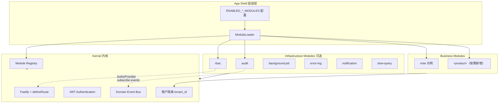
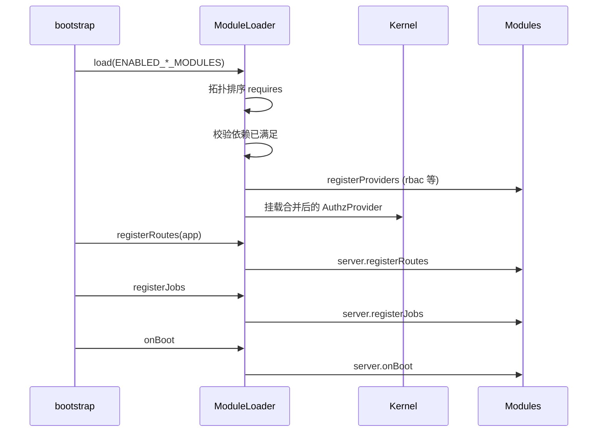

# 模块化与插件化架构设计

## 概述

本文定义 rewindom monorepo 的 **Modular Monolith（模块化单体）** 目标形态：**Kernel（内核）+ Module（模块）**，编译期组装、单进程部署。模块分为**基础设施模块**（如 RBAC、审计、后台任务）与**业务模块**（由各产品自行定义）。应用通过 `ENABLED_*_MODULES` 注册表启用所需能力，实现即插即用。

**当前状态**：Phase 0–5 已完成。模块分两类落盘——**内置模块**是单一 workspace 包 `@be-water/builtin` 内的目录（`packages/builtin/<id>/`），**外部业务模块**是独立包 `modules/<id>/`（`@be-water/<id>`，只依赖 `@be-water/module-sdk`），由 `pnpm gen:module` 生成、`pnpm gen:external-modules` 汇入组装层。包化历史与收敛理由见 §2.3。本文描述**目标态与契约**，迁移 checklist 见 §14。

**设计原则**：

- **内核极简**：内核只保留 HTTP 栈、认证身份（Authentication）、多租户隔离、模块注册表与跨模块契约；不包含具体授权模型或业务域逻辑
- **授权可插拔**：细粒度权限（PBAC/RBAC）作为 `rbac` 模块可选启用；未启用时仅保留 `authenticate` + 可选 `requireSuperuser`
- **模块自包含**：每个模块目录自带 server routes/services、shared 类型、client 页面与 `MODULE.md`（Prisma schema 因单根约束集中存放，见 §8.1）
- **单向依赖**：业务模块可依赖基础设施模块；基础设施模块可依赖内核；禁止内核依赖任何模块实现
- **编译期组装**：TypeScript monorepo 内通过 `ENABLED_*_MODULES` 注册，优先保证类型安全与 AI 可读性；运行时动态 npm 插件为二期能力
- **渐进迁移**：分阶段从现有单体拆分，每个阶段保持可部署、可测试，避免大爆炸重写
- **限界上下文优先**：模块按 bounded context 划分（业务收敛为单个业务包）；模块 id 与模块目录一一对应，租户开关另由 entitlement key 承载（§3.4）

**架构定位（与「换框架」）**：HTTP / UI / ORM / 队列分别使用 Fastify、React、Prisma、BullMQ；自研部分仅为 **ModuleLoader、ProviderRegistry、EventBus、前后端 manifest 合并** 等薄组装层，体量与 NestJS `Module` 相当，但贴合本栈与多租户 SaaS。无现成框架能同时覆盖租户 entitlement 与双壳（租户/平台）；**不建议为模块化而迁移全栈框架**。

**不在本文范围**：具体业务域 API 设计（见各 `docs/design/*.md`）、自助注册 UI。
计费自助见 `billing` 模块（Creem）。

**相关文档**：

| 文档 | 关系 |
| --- | --- |
| [permission-system.md](./permission-system.md) | 现行 PBAC；迁移后逻辑归属 `rbac` |
| [tenant-features.md](./tenant-features.md) | 租户级功能开关；与 App Module 正交 |
| [tenant-config.md](./tenant-config.md) | 多租户配置分层；保留在内核 |

---

## 1. 背景与动机

### 1.1 现状问题

当前仓库已有目录分层（`services/infra`、`services/platform`、`services/tenant`）与租户功能开关（`TENANT_FEATURE_REGISTRY`），但缺少统一的**模块契约**，导致：

| 耦合点 | 现状 | 后果 |
| --- | --- | --- |
| 权限 | `AVAILABLE_PERMISSIONS` 写死在 `@be-water/shared`；`permission.ts` 在中间件层全局注册 | 无法「关闭细粒度权限」；新业务权限必须改共享常量 |
| 路由 | `apps/server/src/routes/index.ts` 中央注册 20+ 路由插件 | 每增业务必改内核入口 |
| 前端路由 | `apps/client/src/App.tsx` 300+ 行 lazy import | 同上 |
| 导航 | `apps/client/src/app-nav.ts` 硬编码业务菜单 | Sidebar 与具体业务强绑定 |
| 调度器 | `scheduler.service.ts` 直接 import 业务服务 | 内核依赖业务 |
| Prisma | 单 `schema.prisma`，`Tenant`/`User` 挂大量业务反向 relation | 删业务需改底座 model |
| 审计 | 各 route 直接调用 `AuditService` | 横切逻辑散落，难以整体禁用 |

### 1.2 目标

1. **底座与业务分离**：内核与基础设施不含业务域知识，只启用所需模块
2. **即插即用**：RBAC、审计、通知等作为可选模块安装/卸载（编译期）
3. **AI 友好**：模块边界清晰，每个模块有 `MODULE.md` 与固定目录结构
4. **人类友好**：`ENABLED_*_MODULES` 配置一目了然；金标准示例模块（`note`）可复制

### 1.3 明确不做（一期）

- ❌ 运行时从 npm 动态加载未编译的第三方插件（无类型安全、难调试）
- ❌ 微服务拆分（仍为单进程 Fastify + SPA）
- ❌ 替换现有 API 响应格式与 `snake_case` 字段约定
- ❌ 一期内完成全部业务模块物理迁移（分阶段进行）

---

## 2. 目标架构

### 2.1 分层总览



### 2.2 三层定义

| 层 | 说明 | 可否禁用 |
| --- | --- | --- |
| **Kernel** | HTTP、认证身份、租户上下文、错误处理、模块加载、事件总线（可选 no-op） | 否 |
| **Infrastructure Module** | 横切 SaaS 能力：RBAC、审计、任务队列、通知、可观测性 | 是（按模块） |
| **Business Module** | 领域功能：按产品需要定义（当前仅含 `note` 示例） | 是（按模块） |

### 2.3 仓库结构（当前）

**10 个 workspace 包**：2 个 app、2 个模块包、4 个库、2 个测试设施。

```
be-water/
├── apps/
│   ├── server/                         # @be-water/server
│   │   ├── src/enabled-modules.ts      # ENABLED_SERVER_MODULES
│   │   ├── src/test/                   # 宿主侧测试装配（createTestApp）
│   │   ├── scripts/                    # 运维/数据脚本 + lib/module-dependency-rules.ts
│   │   └── prisma/                     # schema.prisma + models/ + migrations/
│   └── client/                         # @be-water/client
│       ├── src/enabled-modules.ts      # ENABLED_CLIENT_MODULES
│       ├── src/collect-modules.ts      # collectModuleNav, collectAppRouteTrees
│       ├── src/app-shell-routes.tsx    # 纯壳层守卫与布局
│       └── src/shell/                  # 产品壳层：认证页、Layout、Sidebar
├── modules/                            # 外部业务模块，一模块一包（@be-water/<id>）
│   └── <id>/                           # note（金标准）todo bookmark
│       ├── MODULE.md  MODULE.spec.yaml
│       └── shared/  server/  client/  prisma/
├── packages/
│   ├── builtin/                        # @be-water/builtin — 基础设施 / 壳层 / 站点模块
│   │   └── <id>/                       # rbac audit background-job error-log slow-query
│   │       ├── MODULE.md               #   notification user platform dashboard
│   │       ├── shared/  server/  client/  #   marketing billing site-member site-billing
│   ├── module-sdk/                     # @be-water/module-sdk — 外部模块的稳定门面
│   ├── server-kernel/src/              # @be-water/server-kernel
│   │   ├── kernel/                     # HTTP 壳层路由与认证
│   │   ├── runtime/                    # ModuleLoader、ProviderRegistry、EventBus、JobRegistry
│   │   │                               #   + tenant-catalog / permission-catalog 注入点
│   │   └── infra/  http/  middleware/  lib/
│   ├── client-kit/                     # @be-water/client-kit — api、auth、PageLayout、守卫、slot 机制
│   ├── shared/                         # @be-water/shared — 跨端契约、日期/格式化工具、平台管理员契约
│   ├── ui/                             # @be-water/ui — shadcn 基础组件
│   ├── server-test/                    # @be-water/server-test — 服务端测试装配
│   └── client-test/                    # @be-water/client-test — 前端测试装配
├── docs/design/modular-architecture.md
└── AGENTS.md
```

**为什么业务单独成包**：业务包对 `@be-water/builtin` 是**单向引用，零反向**。
拆成两个包后，「基础设施不得依赖业务」由**包边界强制**——`check-circular-deps` 把二者
划在不同层（`scripts/module-contexts.json`），任何 `builtin → business` 依赖都会被拦下。
同一个包里这条规则只是文档约定，工具看不见。业务包只依赖 `@be-water/module-sdk`
这层门面，不直连内核，内核内部重构才不会波及每个产品模块。

**为什么模块是一个包而不是每模块一个包**：拆包时统计过，模块间的 `@be-water/module-*` 引用有 **967 处来自 modules 内部，仅 47 处来自 apps/packages**。20:1 的比例说明绝大多数"跨包 API"其实是同一限界上下文内部的调用，被包边界强行升格成了公共契约——业务单包那张 44 条的 `exports` 映射表就是代价。收敛为单包后它们退化为相对 import，映射表整体消失。

模块边界改由三道守护替代 npm 包边界：

| 守护 | 位置 | 管什么 |
| --- | --- | --- |
| `import-x/no-cycle` | `packages/builtin/eslint.config.js` | 模块间文件级循环依赖 |
| `validate-module-dependencies` | `apps/server/scripts/` | manifest `requires` 是否覆盖真实的代码 import 与 schema FK |
| `check-circular-deps` | `scripts/` | 包层之间（app / modules / lib / test）的环 |

**维护模式**：本仓库**独立维护**——不作为可 fork 的上游模板，也不从任何上游 `git merge`。
早期文档曾以「压缩与上游的合并冲突面」论证若干取舍（内核 model 不挂业务 relation、
业务独立成包、schema 归属靠链接推导等）。这些**约束依然成立**，但理由已换成分层本身：
单向依赖、包边界可被工具强制。评估新方案时不应再以「上游冲突」为由。

---

## 3. 模块契约（Module Contract）

### 3.1 双 Manifest：`ServerAppModule` / `ClientAppModule`

服务端与前端分别实现 manifest，共享 `ModuleManifestBase`（`@be-water/shared`）。类型完整定义见：

- `packages/shared/src/module-contract.ts` — `ModuleManifestBase`、`TenantModuleEntitlement`
- `packages/server-kernel/src/runtime/module-contract.ts` — `ServerAppModule`
- `packages/client-kit/src/lib/module-contract.ts` — `ClientAppModule`、`ClientShellContributions`

```typescript
/** packages/shared/src/module-contract.ts（摘要） */

export type ModuleKind = "kernel" | "infrastructure" | "business";

export interface ModuleManifestBase {
  id: ModuleId;
  version: string;
  label: string;
  kind: ModuleKind;
  description?: string;
  requires?: ModuleId[];
  /** 本模块提供的租户可开关能力；key 与 id 解耦，一模块可提供多个 */
  tenantEntitlements?: TenantModuleEntitlement[];
  shared?: {
    permissions?: PermissionDefinition[];
    auditActions?: AuditActionDefinition[];
  };
}

/** packages/server-kernel/src/runtime/module-contract.ts（摘要） */

export interface ServerAppModule extends ModuleManifestBase {
  server?: {
    registerMiddleware?: (app, ctx: ServerModuleContext) => Promise<void>;
    registerRoutes?: (app, ctx: ServerModuleContext) => Promise<void>;
    registerJobs?: (ctx: JobRegistryContext) => void;
    onBoot?: (ctx: BootContext) => Promise<void>;
    registerProviders?: (registry: ProviderRegistry) => void;
  };
}

/** packages/client-kit/src/lib/module-contract.ts（摘要） */

export interface ClientAppModule extends ModuleManifestBase {
  client?: {
    routes?: ClientRouteDefinition[];
    renderGuestRoutes?: () => ReactNode;
    renderTenantRoutes?: () => ReactNode;
    renderRoutes?: () => ReactNode;
    renderSuperUserRoutes?: () => ReactNode;
    renderPlatformRoutes?: () => ReactNode;
    nav?: AppNavSection[];
    platformNav?: readonly PlatformNavContribution[];
    mobileTabPaths?: readonly string[];
    shell?: ClientShellContributions;
  };
}
```

一个模块导出**一个** client manifest（如 `note` → `noteClientModule`）。子域的路由、导航、shell 贡献在 `client/module.tsx` 合并后一次注册；租户可开关能力由 `tenantEntitlements` 声明。

### 3.2 模块目录约定

内置模块是 `@be-water/builtin` 包内的一个目录，不是独立 npm 包（理由见 §2.3）；
外部业务模块是独立包 `modules/<id>/`，目录结构相同，仅多 `MODULE.spec.yaml` 与 `prisma/`。
每个 `packages/builtin/<id>/`（或 `modules/<id>/`）必须包含：

```
packages/builtin/<id>/
├── MODULE.md                 # 人类 + AI 说明（必选）
├── shared/index.ts           # 跨端类型、权限常量（无跨端 DTO 的模块可省略，如 user/rbac）
├── server/
│   ├── index.ts              # 导出 *ServerModule
│   ├── routes/
│   └── services/
└── client/
    ├── module.tsx            # 导出 *ClientModule
    ├── pages/
    └── components/
```

**Prisma schema 在模块目录内**（`packages/builtin/<id>/models.prisma`）。
Prisma 只认单一 schema 目录，故 `apps/server/prisma/models/` 下放**符号链接**指向各包内的真实文件——
汇合点是 Prisma 的要求，所有权仍属各包，链接目标即归属声明（见 §8.1）。

**引用规则**：

| 从 | 到 | 写法 |
| --- | --- | --- |
| 模块内部 | 本模块 | 相对路径 `./x.js` |
| 模块 | 兄弟模块 | 相对路径 `../<other>/server/x.js`；须在 manifest `requires` 声明 |
| apps / packages | 内置模块 | 包规格 `@be-water/builtin/<id>/server/index.js` |
| apps / packages | 外部业务模块 | 包规格 `@be-water/<id>/server` |
| 模块 | 宿主 app（`@be-water/server`） | **禁止**，含测试；模块测试须自足 |

大域可在包内按子域再分层（不必新建模块），例如业务包：

```
modules/<domain>/
  client/<subdomain-a>/    # entitlement key: <subdomain-a>
  client/<subdomain-b>/
  server/<subdomain-a>/
  server/<subdomain-b>/
```

### 3.3 `MODULE.md` 模板

每个模块根目录的 `MODULE.md` 供 AI 与人类快速理解：

```markdown
# module-<id>

## 用途
一句话描述。

## 依赖
- kernel
- rbac（若需要 permission）

## 启用
在 `apps/server/src/enabled-modules.ts` 与 `apps/client/src/enabled-modules.ts` 中注册。

## 配置
| 变量 | 说明 |
| --- | --- |

## 扩展点
- 注册的权限：...
- 发布的事件：...

## 禁止
- 不要直接修改 kernel/...
- `server/**` 不要 import 宿主 `apps/server/src/`；使用 `@be-water/server-kernel`、本包路径
```

### 3.4 模块 id vs Entitlement key

| 维度 | 规则 | 示例 |
| --- | --- | --- |
| **模块 id** | 与模块目录（部署单元）**一一对应**，一目录一 manifest | `note`、`rbac`、`audit` |
| **Entitlement key** | 租户可开关能力；持久化在租户设置中，**与模块 id 解耦** | `note`、`<domain>.<subdomain>` |
| **何时新建模块** | 独立 bounded context、无紧耦合、可被单独禁用 | 业务子域进 `modules/<domain>/<subdomain>/`，不新建物理模块 |
| **何时勿新建** | 仅为「模块数量」或目录整齐 | — |

**为何解耦**：entitlement key 是租户设置中的持久化标识。若它等同 manifest `id`，
合并或拆分模块就会改变 key，令所有租户的存量开关状态失效。解耦后 rewindom
一个模块提供 10 个 entitlement，子域合并对租户完全透明。

**新增模块 = 新增目录**，不再需要新建 npm 包：复制 `modules/note/`（金标准），
在两个 `enabled-modules.ts` 注册即可。

---

## 4. 内核（Kernel）职责

### 4.1 保留在内核的能力

| 能力 | 说明 |
| --- | --- |
| HTTP 栈 | Fastify、`defineRoute`、`{ data }` 响应、错误处理中间件 |
| Authentication | JWT 双 Token、登录/登出/刷新、`request.authUser` |
| 多租户 | `tenant_id` 解析、`tenant-scope`、默认租户 bootstrap |
| 平台管理员 | `PLATFORM_ADMIN` 身份（env 凭据），与租户 User 分离 |
| 模块加载 | `ModuleLoader`：排序、注册路由、合并权限目录、调用 `onBoot` |
| 请求上下文 | `request-context`、慢查询关联字段（不含慢查询存储本身） |
| 配置 | `config.ts` 分层读取（Platform env） |

### 4.2 从内核迁出的能力

| 现行位置 | 目标模块 |
| --- | --- |
| `middleware/permission.ts`、`UserPermission` | `rbac`（`permission.middleware.ts`） |
| `services/infra/audit.service.ts`、`AuditLog` | `audit` |
| `services/background-job/*`、`BackgroundJob` | `background-job` |
| `services/infra/error.service.ts`、`ErrorLog` | `error-log` |
| `services/infra/slow-query.service.ts` | `slow-query` |
| Notification 相关 | `notification` |
| 各 `services/tenant/*` 业务域 | 对应 `module-*` |

### 4.3 认证 vs 授权

**内核只定义 Authentication**：

```typescript
interface AuthUser {
  userId: string;
  tenantId: string;
  tenantSlug: string;
  role: "USER" | "SUPERUSER";
}
```

**授权通过 `AuthzProvider` 抽象**（内核定义接口，模块实现）：

```typescript
interface AuthzProvider {
  check(request: FastifyRequest, permission: string): Promise<AuthzResult>;
  checkAny(request: FastifyRequest, permissions: string[]): Promise<AuthzResult>;
  getUserPermissions(userId: string): Promise<string[]>;
  getPermissionCatalog(): PermissionCatalog;
}

/** 未启用 rbac 时的默认实现 */
class AuthenticatedOnlyAuthz implements AuthzProvider {
  async check(request) {
    return { allowed: !!request.authUser };
  }
  // ...
}
```

`app.requirePermission` 由内核注册，内部委托给当前 `AuthzProvider`；`rbac` 在 `registerProviders` 中替换实现。

---

## 5. 基础设施模块设计

### 5.1 `rbac`

**职责**：细粒度权限（一期沿用 PBAC + `UserPermission`；二期可在模块内增加经典 RBAC 的 `Role`/`RolePermission`）。

| 项 | 内容 |
| --- | --- |
| Prisma | `UserPermission`（及可选 `Role*`） |
| Server | `/api/permissions`、权限校验、`invalidateUserPermissionCache` |
| Shared | 模块内 `permissions` 聚合，不再使用全局 `AVAILABLE_PERMISSIONS` 常量表 |
| Client | `PermissionRoute`、`usePermissions`、用户权限勾选 UI |

**未启用时**：

- 路由仅 `app.authenticate` + `app.requireSuperuser`（租户管理员）
- 前端 `PermissionRoute` 退化为 `AuthenticatedRoute`
- 无权限管理 API 与 UI

**默认建议**：**默认启用**；架构上必须支持关闭以验证模块化。

### 5.2 `audit`

**职责**：写操作审计日志。

- 订阅内核 **Domain Event Bus**（如 `note.created`、`user.deleted`）
- 或提供 `AuditService` 供模块显式调用（过渡期兼容）
- Prisma：`AuditLog`
- 平台端：审计日志列表页

**未启用时**：`AuditService` 为 no-op；不写入 `AuditLog` 表（可不创建该表）。

### 5.3 `background-job`

**职责**：BullMQ 任务、 `BackgroundJob` 表、任务列表 API/UI。

- 各业务模块通过 `registerJobs` 注册 job handler
- 内核 `bootstrap` 仅调用 `JobRegistry.start()`，不 import 具体 job

### 5.4 `error-log` / `slow-query` / `notification`

各自包含 model、查询 API、平台/租户 UI（如有）。从 `scheduler.service.ts` 迁出清理逻辑到对应模块的 `registerJobs`。

---

## 6. App Module、Tenant Module 与 Tenant Feature

三套开关，**正交**：

| 维度 | App Module | Tenant Module | Tenant Feature |
| --- | --- | --- | --- |
| 控制粒度 | 部署 / 编译期 | 单租户运行时（模块级） | 单租户运行时（功能级） |
| 配置位置 | `enabled-modules.ts`、`.env` | 租户 entitlement 配置 | `TenantSetting` / entitlement |
| 效果 | 路由/代码是否加载 | 租户是否开通该业务模块 | 租户能否使用该子功能 |
| 示例 | 部署含 `note` | 租户开通 `note` | 租户开通某细粒度 feature key |
| manifest 字段 | `ENABLED_*_MODULES` | `tenantEntitlements[].key` | `tenantEntitlements[].features[].key` |

**路由守卫顺序**：

1. `app.authenticate`
2. App Module 已启用（否则 404 或启动时不注册路由）
3. `AuthzProvider.check`（若启用 rbac）
4. entitlement 守卫（`TenantModuleRoute` / `TenantEntitlementRoute`、`registerTenantGatedRoutes`）

各模块在 manifest 声明 `tenantEntitlements`；加载时由 `collectTenantCatalogFromManifests` 合并进租户目录，按 **entitlement key** 建索引，不再在 `@be-water/shared` 硬编码业务专用 key。

**为何与模块 id 解耦**：entitlement key 是租户设置中的持久化标识。若它等同 manifest `id`，则合并/拆分物理模块会改变 key，令所有租户的存量开关状态失效。解耦后一个物理模块可提供多个 entitlement，子域合并对租户完全透明。

---

## 7. 模块加载与生命周期

### 7.1 启用配置

```typescript
// apps/server/src/enabled-modules.ts
import { rbacServerModule } from "@be-water/builtin/rbac/server";
import { noteServerModule } from "@be-water/note/server";
// ...

export const ENABLED_SERVER_MODULES = [
  rbacServerModule,
  noteServerModule,
  // ...
] as const satisfies readonly ServerAppModule[];
```

```typescript
// apps/client/src/enabled-modules.ts
import { noteClientModule } from "@be-water/note/client/module";
// ...

export const ENABLED_CLIENT_MODULES = [
  noteClientModule,
  // ...
] as const satisfies readonly ClientAppModule[];
```

可选环境变量覆盖（运维用）：

```bash
# 逗号分隔，须与模块 id 一致；未设置则用 enabled-modules.ts 默认
ENABLED_SERVER_MODULES = [rbac, audit, note, …]
```

### 7.2 `ModuleLoader` 流程



### 7.3 启动失败策略

- 缺少 `requires` 依赖 → **启动失败**（fail fast）
- 模块 `onBoot` 抛错 → 记录 error 日志；可配置 `MODULE_STRICT_BOOT=1` 时阻塞启动

---

## 8. Prisma 模块化

### 8.1 Schema 组织

使用 Prisma multi-file schema（Prisma 7：`prisma.config.ts` 中 `schema: "prisma"` 指向目录，**递归**收集 `*.prisma`）：

```
apps/server/prisma/
  schema.prisma          # generator + datasource
  models/                # 符号链接汇合点，指向各包内的真实 schema
  migrations/            # 单一迁移目录（§8.3）

packages/server-kernel/prisma/kernel.prisma      # 内核 model
packages/builtin/<id>/models.prisma              # 内置模块（勿命名为 schema.prisma，以免语言服务当独立根）
modules/<id>/prisma/schema.prisma                # 外部业务模块
```

`db:generate` 就是裸 `prisma generate`，**无生成步骤、无 profile 裁剪、无 stash**。

**为何要有汇合点**：Prisma 只认单一 schema 目录，且业务子域的 `.prisma` 文件之间
往往存在跨文件 `@relation`——它们是一张连通图，无法各自独立 generate。

**为何仍用符号链接而非把文件搬进汇合点**：所有权。曾经把它们全部铺平为实体文件，
结果是三个包的 model 堆在宿主 app 里，归属只能靠一张**手工维护的映射表**
（`SCHEMA_FILE_OWNER`）承载——加模块必须记得同步改表，漏改则归属静默错误。改回链接后：

- 归属由**链接目标**推导——`packages/server-kernel/prisma/…` → kernel，
  `packages/builtin/<id>/…` → 该内置模块，`modules/<id>/…` → 该业务模块
- 那张映射表整体删除，`module-dependency-rules.ts` 改为 `readlinkSync` 反推
- 新增模块只需建链接，无第二处登记

早先删掉的「复杂机器」是按 profile **创建 / 暂存 / 编织**链接的同步脚本；
静态提交的链接不需要任何脚本。

> 注意：git 中的符号链接在 Windows 需 `core.symlinks=true`。
> 发布打包用 `cp -r` 会解引用为实体文件，生产链路不受影响。

### 8.2 关系规则

- **内核 model 不声明业务反向 relation**。`User` 上只保留 infra 模块的反向关系（`audit_logs`、`background_jobs`、`notifications`）。理由是单向依赖（§概述）：内核声明指向业务表的 relation 就等于内核认识业务，删除或停用某业务模块会连带改坏 `kernel.prisma`。
- 业务表引用内核用户时使用**裸列**（如 `<BizModel>.owner_user_id`），不声明 `@relation`。

  **代价（必须知悉）**：Prisma 的关系必须双向声明，`<BizModel>.owner` 存在就必然要求 `User.owned_<biz>s`。要满足本规则只能放弃该关系，随之失去**数据库级外键**与 `onDelete` 行为。`User` 是硬删除（`kernel/auth/auth.service.ts`），因此删用户后 `owner_user_id` 会留悬空 id；展示层需自行降级（批量查用户名，查不到即为 `null`），且 DTO 仍会返回该悬空 id。新增此类引用时须同样处理。

- 跨模块引用：优先通过 **模块 id + 服务接口**，避免 Prisma 跨文件 relation（除非明确同一 bounded context）。

### 8.3 Migration 策略

| 项 | 策略 |
| --- | --- |
| 迁移目录 | 单一 `apps/server/prisma/migrations/`。Prisma 的迁移历史是全局线性的，一个 `migration.sql` 常跨多个模块的表，且 FK 依赖决定跨模块执行顺序——**不拆分** |
| 破坏性变更 | 蓝绿共享库下 `DROP` 会打挂旧槽位，必须拆两版发布（expand-contract） |
| 禁止 | 为模块化随意 `migrate reset` |

---

## 9. 服务端扩展点

### 9.1 路由注册

内核 `registerAllRoutes` 固定注册：

- `/api/auth`、`/api/public`、`/health`
- 内核级 `/api/users`（若未迁入模块）、平台租户管理等

其余全部由 `ModuleLoader.registerRoutes` 追加。

### 9.2 Domain Event Bus（推荐）

内核提供轻量事件总线，解耦审计与业务：

```typescript
// 业务模块
app.events.emit("note.created", { noteId, operatorId, tenantId, ip, userAgent });

// audit 订阅
events.on("note.created", (payload) => AuditService.log(...));
```

事件名约定：`<resource>.<action>`，`snake_case` 与审计 action 对齐。

### 9.3 Provider Registry

| Provider | 默认（内核） | 模块覆盖 |
| --- | --- | --- |
| `AuthzProvider` | `AuthenticatedOnlyAuthz` | `rbac` |
| `AuditPublisher` | no-op | `audit` |
| `NotificationPublisher` | no-op | `notification` |

### 9.4 跨模块通信决策表

模块间协作应优先选 **最弱耦合** 机制；`apps/server/scripts/validate-module-dependencies.ts` 校验 `requires` 与代码 import 图。

| 场景 | 推荐 | 避免 |
| --- | --- | --- |
| 审计写入 | `events.emit('audit.log', payload)`；`audit` 在 `onBoot` 订阅 | kernel / 其他模块直接 import `AuditService` |
| 可替换横切能力 | `ProviderRegistry`（`AuthzProvider`、公开配置、租户 API Key 等） | 硬编码具体模块 service |
| 同限界上下文内 | 包内 service 直接调用 | — |
| 跨限界上下文读 | Provider 只读接口、模块对外 `shared` 类型 | 跨包 import `server/services` |
| 跨限界上下文写 | 领域事件（`EventBus`） | 直接改对方 Prisma model |
| 跨模块 Prisma relation | 默认 **禁止**；同一聚合 / 同一模块内可例外并文档化 | 内核 model 挂业务反向 relation |
| 前端跨模块 UI | `createComponentSlot` + `shell.shellProviders`（见 §10.5） | 壳层页面 import 业务组件 |

事件名约定：`<resource>.<action>`，与审计 action 对齐。Handler 失败不阻塞发布方主事务（见 `EventBus.emit`）。

---

## 10. 客户端扩展点

### 10.1 路由组装

`apps/client/src/App.tsx` 通过组装层聚合模块贡献：

```typescript
const nav = collectModuleNav(ENABLED_CLIENT_MODULES);
const routeTrees = collectAppRouteTrees(ENABLED_CLIENT_MODULES);
```

`collectAppRouteTrees` 合并各模块的 `renderTenantRoutes` / `renderPlatformRoutes` 等，或将 `client.routes` 转为 React Router `<Route>`，并包装 `PermissionRoute` / `TenantEntitlementRoute`（若对应模块已启用）。

### 10.2 导航

`Sidebar` 从 `collectModuleNav(ENABLED_CLIENT_MODULES)` 读取；同名 section 自动合并 items。模块未启用则不出现菜单项。组装层契约见 `apps/client/src/app-nav.ts`（仅 re-export，不含业务硬编码）。

### 10.3 权限 Hook

`usePermissions` 由 `rbac` 提供；未启用时返回「已认证即全部允许」或仅区分 `SUPERUSER`。

### 10.4 代码分割

各模块页面保持 `React.lazy`；`vite-manual-chunks` 可按 `packages/builtin/<id>` 分包。

### 10.5 Component Slot（跨模块 UI）

壳层提供通用注入机制（`packages/client-kit/src/component-slot.tsx`）：

```typescript
export function createComponentSlot<P>(displayName: string): ComponentSlot<P> {
  // Provider 注册具体组件；消费方通过 useSlot() 渲染，无需 import 提供方
}
```

**Slot 声明位置**：由**消费方**模块在自己的 `client/.../shell/` 下定义 slot；提供方通过 `shellProviders` 注册 `Provider`，消费方视图 `useSlot()` 渲染。

```typescript
// <provider-module>/client/module.tsx
shell: {
  shellProviders: [MyDetailSlots],
},
```

```typescript
// MyDetailSlots 内
<someDetailSlot.Provider component={MyDetailSection}>
  {children}
</someDetailSlot.Provider>
```

| Slot 文件 | 用途 | 提供方模块 | 消费方 |
| --- | --- | --- | --- |
| `platform/.../platform-widget-slots.ts` | 平台控制台头部/表格/租户卡片 | `notification`、`user` | `platform` |
| `user/.../shell/user-menu-slots.ts` | 用户菜单扩展区 | 任意模块 | `user`（`UserAvatar`） |
| `shell/auth-login-hero` | 登录页 Hero（可替换品牌文案） | 业务模块 | 壳层登录页 |

模块禁用时 slot 为空，视图优雅降级。`platform` **不得** import 具体业务组件。

**演进方向**：新 slot 在消费方模块 `client/shell/` 定义；`client-shell` 仅保留 `createComponentSlot` 机制。

### 10.5.1 工作台卡片（`dashboardWidgets`）

`/app/dashboard` 是租户登录后的默认首页（`dashboard` 模块）。它只提供栅格、可见性过滤与
单卡片错误隔离，**不 import 任何业务组件**；卡片由拥有数据的模块自己声明：

```typescript
// <module>/client/module.tsx
client: {
  dashboardWidgets: [
    {
      id: "note.recent",        // 约定 `<moduleId>.<name>`，重复 id 只保留先注册的
                                 // 同时是用户布局偏好的持久化键——发布后不要再改
      title: "note:dashboard.title", // 配置面板里的名称，`namespace:key`，渲染时才解析
      icon: StickyNote,          // 配置面板列表项图标
      component: LazyWidget,     // 用 lazy()，落地页不该背业务代码
      order: 20,                 // 默认顺序，升序，默认 100；相同值按模块注册顺序
      span: 1,                   // 2 = 桌面端横跨两列
      tenantModule: "note",     // 与导航项同义：租户没开通就不渲染
      anyPermission: ["note.read"],
    },
  ],
}
```

与 Component Slot 的区别：slot 是「一个位置一个组件」的替换，卡片是**多方向同一网格追加**，
所以走注册表而非 Context。模块拿不到 `ENABLED_CLIENT_MODULES`，由组装层依赖倒置注入
（`prepareAppRoutes` → `registerDashboardWidgetsProvider`，同 `configureClientTenantCatalog`）。

可见性口径与导航项一致：权限 fail-closed（未加载先隐藏）、entitlement fail-open。
`/app/dashboard` 本身不设开关也不设权限——它是落地页兜底，关掉就等于登录后无处可去。

在这之上还有一层**用户级布局**：每个用户可自行隐藏卡片、拖拽排序，存在
`DashboardPreference`（`dashboard` 模块的 server 面，`GET/PUT/DELETE /api/dashboard/preferences`）。
两层顺序不能反——先按租户/权限算出「允许看到什么」，再套用户的「想看什么」，
否则用户能把无权访问的卡片显示出来。卡片外壳统一用 `client-kit` 的 `DashboardWidgetCard`。
详见 `packages/builtin/dashboard/MODULE.md`。

### 10.6 `ClientShellContributions`

除路由与导航外，模块可通过 `client.shell` 贡献壳层 UI（`ClientShellContributions`）：

| 字段 | 说明 |
| --- | --- |
| `shellProviders` | 包裹应用以注册 Component Slot |
| `sidebarToolbar` / `sidebarPrimaryAction` / `sidebarPanel` | 侧栏扩展 |
| `sidebarUserMenu` | 用户菜单区 |
| `mobileHeaderTrailing` / `mobileHeaderRoutes` | 移动端顶栏 |
| `navBadge` / `platformNavBadge` | 租户/平台侧栏角标 |
| `useImpersonationActive` | 模拟登录状态 hook |

---

## 11. 模块目录（rewindom 映射）

### 11.1 基础设施模块

| 模块 id | 说明 | 包路径 |
| --- | --- | --- |
| `rbac` | PBAC / 未来 RBAC | `packages/builtin/rbac` |
| `audit` | 审计日志 | `packages/builtin/audit` |
| `background-job` | 后台任务 | `packages/builtin/background-job` |
| `error-log` | 错误日志 | `packages/builtin/error-log` |
| `slow-query` | 慢查询 | `packages/builtin/slow-query` |
| `notification` | 站内通知 | `packages/builtin/notification` |
| `user` | 用户 CRUD | `packages/builtin/user` |
| `platform` | 平台控制台壳层 | `packages/builtin/platform` |

平台数据备份等能力在 `platform` 内（无独立 `data-backup` 包）。租户设置 / API Key / 用量（逻辑 id `settings`）属业务，作为 `settings/` 子域并入业务包，不再有独立 `settings` 包。

**基础设施模块的依赖方向**：infra 模块（如 `user`）**禁止** import 业务包；需要业务 UI 嵌入 infra 视图时，由 infra 侧声明 Component Slot、业务侧注册 Provider（示例：用户菜单用量卡 `userMenuUsageSlot`，见 §10.5）。

### 11.2 业务模块

当前仓库只有 `note`（id `note`，entitlement key `note`，`requires`: `rbac`、`audit`）
一个业务模块，同时充当金标准示例——新模块从它复制起步。

产品业务增长到需要与 infra 分离时，在 `modules/<id>/` 下建业务包（`kind: "business"`），
由 `scripts/module-contexts.json` 的 `business` 层承接，`check:deps` 即可拦住「基础设施依赖业务」。

**单包 vs 多包**：业务子域建议收敛为**一个包 + 一个 manifest**，子域作为包内目录，不各自导出 manifest。
理由是子域之间 import 频繁、Prisma model 互相 `@relation`，拆成多包只会把包内调用变成跨包依赖，
反而给循环依赖检测增加成本。通用 SaaS 能力留在 Shell（§11.1）。

包内子域可互引；跨 Shell 仅通过 manifest `requires` 与 Event Bus / Provider。

**注册顺序**：`client/module.tsx` 中子域的合并顺序决定侧栏 section 顺序、移动端 tab 顺序与 `mobileHeaderRoutes` 匹配优先级。改动顺序会改变 UI 行为。

### 11.3 保留在内核 / App Shell

| 能力 | 位置 |
| --- | --- |
| JWT 认证、登录/刷新、`request.authUser` | `packages/server-kernel/src/kernel/` |
| 租户上下文、`tenant-scope`、默认租户 bootstrap | `server-kernel` |
| `PLATFORM_ADMIN` 平台管理员身份 | 内核 |
| HTTP 约定、`defineRoute`、全局错误处理 | `server-kernel` |
| 纯壳层路由守卫与 Layout | `apps/client/src/shell/`、`apps/client/src/app-shell-routes.tsx` |
| 模块路由/导航组装 | `apps/client/src/collect-modules.ts` |

用户 CRUD、平台租户管理、套餐配额已迁入 `user`、`platform`（不再留在内核业务路由）。

### 11.4 模块组织原则

#### 通用模块（`kind: infrastructure`）— 单一职责（SRP）

每个通用模块只承载**一种横切能力**，可被任意业务模块依赖，但自身不承载业务域逻辑：

| 模块 | 职责 |
| --- | --- |
| `rbac` | 权限 / `AuthzProvider` |
| `audit` | 审计写入与查询 |
| `background-job` | 后台任务队列 |
| `error-log` / `slow-query` | 可观测性 |
| `notification` | 通知与活动中心 |
| `user` | 用户 CRUD |
| `platform` | **平台控制台壳层**（布局、租户管理、配额 guard），不收纳业务域 UI |

若模块同时有租户查询与平台 admin 视图（如 `audit`），仍属同一能力，平台路由只是 admin 视图，不违反 SRP。

#### 业务模块（`kind: business`）— 租户侧 / 平台侧二分

每个业务域一个 `modules/<domain>/` 包，**包内**按面拆分：

```
modules/<domain>/
  client/
    tenant/           # 租户侧：renderRoutes、nav、pages
    platform/         # 平台侧：renderPlatformRoutes、platformNav
  server/
    *.routes.ts       # /api/* 租户路由
    platform-*.routes.ts   # /api/platform/* 平台路由（requirePlatformAdmin）
```

| 挂载点 | Server | Client |
| --- | --- | --- |
| 租户侧 | `/api/*` + `requirePermission` | `renderRoutes` / `renderTenantRoutes` + `nav` → `AppLayout` |
| 平台侧 | `/api/platform/*` + `requirePlatformAdmin` | `renderPlatformRoutes` + `platformNav` → `PlatformLayout` |

**骑墙模块**（同一包兼有租户面与平台面）在 `scripts/module-contexts.json` 中归入 `bridge` 上下文；循环依赖检测对 `bridge ↔ platform` 的跨界边保持棘轮守护。

#### 平台壳层与业务模块的边界

- `platform` **不得** import 具体业务实现；通过扩展点反向组装：
  - 路由：`renderPlatformRoutes` 由各模块自注册
  - 导航：各模块导出 `platform/nav.ts`，由 `platform-nav-config` 聚合
  - 头部 widget：`platform-widget-slots`（`activityCenterSlot`、`userAvatarSlot` 等）
  - 租户卡片 widget：`tenantCardActionsSlot`
  - 侧栏角标：`shell.platformNavBadge` + `NavBadgeRegistryProvider`

业务模块禁用时，对应 slot 为空，平台视图优雅降级。

---

## 12. 配置与环境变量

### 12.1 模块级配置

```bash
# 启用模块列表（可选，覆盖 modules.ts）
ENABLED_SERVER_MODULES = [rbac, audit, note, …]

# 严格启动：任一模块 onBoot 失败则 exit(1)
MODULE_STRICT_BOOT=0
```

### 12.2 与现有 env 的关系

Platform 层 env（`DATABASE_URL`、`JWT_SECRET` 等）不变，见 [tenant-config.md](./tenant-config.md)。模块特有配置使用前缀：

```bash
# <domain>/<subdomain>（示例）
MY_SUBDOMAIN_TIMEOUT_MS=30000
```

---

## 13. 测试策略

| 层级 | 策略 |
| --- | --- |
| 内核 | 单元测试 + 无模块启动 smoke test |
| 基础设施模块 | 独立 vitest；mock `AuthzProvider` |
| 业务模块 | 契约测试 + 与依赖模块的集成测试 |
| 组装层 | 启用模块最小集 E2E（note only） |
| CI | Matrix：`kernel+rbac`（saas-kit profile smoke）、`full-be-water`（默认 test job） |

每个模块需提供 `MODULE.md` 中「如何单独测试」小节。

---

## 14. 迁移路线图

### Phase 0：契约与加载器（不改行为）

- [x] 新增 `module-contract.ts`、`ModuleLoader` 骨架
- [x] `routes/index.ts` 改为「内核路由 + `registerModuleRoutes`」结构，现有路由暂时作为一个虚拟 `legacy` 注册
- [x] 文档、AGENTS.md 索引更新；client `collectModuleNav` / `renderModuleRoutes`；`extension-points` rule、`create-module` skill

### Phase 1：基础设施模块化

- [x] 抽出 `rbac`，内核提供 `AuthenticatedOnlyAuthz` fallback
- [x] 抽出 `audit`，引入 Event Bus 或兼容层
- [x] 抽出 `background-job`，`scheduler` 只遍历 job registry

### Phase 2：前端注册表

- [x] `collectModuleRoutes` / `collectModuleNav`（`renderModuleRoutes` + legacy 桥接）
- [x] 业务菜单从 `app-nav.ts` 迁到各业务模块 manifest（nav 按域拆分；`collectModuleNav` 合并同名 section）
- [x] `App.tsx` 瘦身

### Phase 3：Prisma 与业务模块

- [x] 内核 schema 去掉业务反向 relation
- [x] 按 §11.2 逐个迁业务模块（`note` 金标准 + 其余域路由/导航拆分）
- [x] 删除 `legacy`（已拆为 kernel routes + user/platform/settings + 各业务模块）

### Phase 4：模块清单与文档

> 本阶段原以「导出可 fork 的 Template」为目标。该目标已作废——仓库改为独立维护，
> 不再充当上游模板，也不再有下游同步（见 §2.3）。以下条目按当时的完成情况保留为历史记录。

- [x] ~~monorepo 内 `init-project.ts` 模块清单与拓扑校验~~（已删除：以字符串字面量维护第二份产品源码，不可维护）
- [x] `kernel` + 默认 infra modules + `note` 的模块划分落地
- [x] `MODULE.md` 完善

每阶段完成后：**可部署、可跑 `pnpm check`、可写迁移说明**。

### Phase 3.5：物理收拢（已完成）

行为拆分（Phase 3）完成后，`routes/` 与 `services/` 中仍有历史文件。新代码应直接写在 `packages/builtin/<id>/`；遗留目录按模块逐步清空：

| 批次 | 内容 | 状态 |
| --- | --- | --- |
| 3.5a | `user` / `error-log` / `slow-query` 租户路由迁入各自模块 | 已完成 |
| 3.5b | `platform/*` 路由迁入 `platform` | 已完成 |
| 3.5c | `services/infra/*`、`services/background-job/*`、`services/platform/*`、`services/document/*` 迁入对应模块；内核 auth/redis/scheduler/translation 迁入 `kernel/services/` | 已完成 |
| 3.5d | `routes/shared/define-route`、`pagination` 迁入 `kernel/http/`；内核路由迁入 `kernel/routes/` | 已完成 |
| 3.5e | `src/errors`、`src/middleware`、`src/utils`、`src/data` 按归属迁入 `kernel/` 或 `packages/builtin/<id>/`；Prisma schema co-locate 到 `packages/builtin/<id>/schema.prisma`；`TenantApiKeyAuthProvider` 解耦 kernel auth | 已完成 |

`apps/server/src/routes/` 仅保留 `index.ts` 组装入口；`services/` 目录已删除。`apps/server/src/modules/` 已清空（业务代码在 `packages/builtin/<id>/`）。

### Phase 5：业务模块目录化（已完成）

内置模块曾各自是扁平 workspace 包 `packages/modules/module-<id>/`；后收敛为**单一包
`@be-water/builtin`** 内的目录 `packages/builtin/<id>/`（理由与统计见 §2.3）。
外部业务模块走相反方向：一模块一包 `modules/<id>/`，只依赖 `@be-water/module-sdk`。

```
packages/builtin/         # @be-water/builtin，exports 仅 "./*": "./*"
├── package.json
├── eslint.config.js      # import-x/no-cycle
├── vitest.config.ts      # 展开 <id>/{server,client,shared} 三类 project
└── <id>/
    ├── MODULE.md
    ├── shared/           # 域类型、entitlements slice
    ├── server/           # ServerAppModule + routes/services
    └── client/           # pages、hooks、components
```

- **Server 组装**：`apps/server/src/enabled-modules.ts` 仅从 `@be-water/builtin/<id>/server/index.js` import；外部模块经 `src/external-modules.ts`（`pnpm gen:external-modules` 生成）汇入
- `apps/client/src/enabled-modules.ts` 从 `@be-water/builtin/<id>/client/module.js` 与 `@/shell` import
- **Prisma**：schema 集中在 `apps/server/prisma/models/`，migrations 同目录（§8）
- **@be-water/shared**：域 DTO 在各模块 `shared/`；内核/横切契约留在包内
- **工具链**：`validate-module-dependencies.ts` + `check-circular-deps.mjs` + `packages/builtin/eslint.config.js`

**禁止**（更新）：

- `kernel/` 不得 `import` 业务模块实现（模块通过 `ProviderRegistry`、Event Bus 或路由注册反向挂接内核）
- 模块 `server/**` 不得 `import` 宿主 `apps/server/`（含测试）；内置模块用 `@be-water/server-kernel`、`@be-water/shared`、本模块内相对路径或兄弟模块相对路径，外部业务模块只用 `@be-water/module-sdk`

平台管理员凭据（`platform-admin.service`）、内部用户过滤（`internal-users`）属于内核认证范畴，留在 `kernel/services/`。

内核路由访问模块能力的标准方式：

| 能力 | 机制 | 实现模块 |
| --- | --- | --- |
| 审计写入 | `app.events.emit('audit.log', payload)` | `audit` 在 `onBoot` 订阅 |
| 公开配置 / 自助注册 | `app.registry.getPublicConfigProvider()` / `getTenantRegistrationProvider()` | `platform` 在 `registerProviders` 注册 |
| 租户 API Key 认证 | `app.registry.getTenantApiKeyAuthProvider()` | `platform` 在 `registerProviders` 注册 |
| 翻译长度上限 | `kernel/translation-limits.ts` 常量 | 文档模块 re-export |

---

## 15. AI 与开发约定

**Agent-first 产品口径与成功标准**见 [agent-first.md](./agent-first.md)。本节只列修改边界与 Skills 索引。

### 15.1 修改边界

| 任务 | 允许修改 |
| --- | --- |
| 新增业务功能 | `modules/<id>/`（`gen:module`）或 `packages/builtin/<id>/` + `enabled-modules.ts` 注册 |
| 修改权限模型 | `rbac` only |
| 修改 HTTP 约定 | kernel only（需 RFC） |
| 新增租户功能开关 | 模块 manifest `tenantEntitlements` + 平台 UI |

### 15.2 Skills

| Skill | 用途 |
| --- | --- |
| `create-module` | 按契约创建新模块端到端 |
| `extract-module` | 从单体迁出模块 checklist |
| `frontend-page-structure` | 前端 Page / Hook / Lib / Component |
| `error-logging` | ErrorLog 与可观测 |
| `prisma-sync-fix` / `merge-migrations` | Prisma 同步与 migration 收敛 |

完整列表与双 IDE 同步见 `AGENTS.md`。

---

## 16. 待决事项

| # | 问题 | 状态 / 建议 |
| --- | --- | --- |
| 1 | 用户/平台管理是否独立为 `user` / `platform`？ | **已决**：已独立为模块包 |
| 2 | PBAC 与经典 RBAC 是否同一模块两种模式？ | **建议**：均在 `rbac` 内配置 |
| 3 | 单租户部署是否禁用多租户 UI？ | **已决**：env `SINGLE_TENANT=true`；注册/OAuth 进默认租户；禁止新建租户；隐藏平台租户管理入口与租户筛选；登录不展示 `@tenant` 提示 |
| 4 | 跨模块 Prisma relation 是否允许？ | **已决**：默认禁止；同一模块 / 聚合内可例外 |
| 5 | Event Bus 同步还是异步？ | **已决**：`emit` await 各 handler；审计失败不阻塞主事务 |
| 6 | Component Slot 声明是否迁出 `client-shell`？ | **已完成**：slot 均在消费方模块 `client/shell/`；`client-shell` 仅保留 `createComponentSlot` |
| 9 | 业务跨物理包环 | **已收敛**：业务归单包；跨 Shell 环由 `check:deps` 基线棘轮 |
| 7 | Event payload 是否类型化目录？ | **已完成**：`packages/server-kernel/src/runtime/domain-events.ts` + `EventBus` 泛型 `on`/`emit` |
| 8 | 模块边界 CI 是否引入 dependency-cruiser？ | **已决（替代方案）**：`check-circular-deps.mjs`（包级环棘轮）+ `validate-module-dependencies.ts`（requires / 代码 import / schema FK）；根目录 `pnpm check:deps` 串联两者；CI 见 `.github/workflows/architecture.yml`。TS 文件级 dependency-cruiser 仅在上述不足时再评估 |
| 10 | 业务物理包是否继续按功能拆分？ | **已决**：业务收敛为单包，Shell/Infra 保持独立。理由见 §11.2 |
| 11 | `user` 是否保留？可否依赖业务包？ | **已决**：保留为 infra 模块（通用 SaaS 能力；内核只留 Authentication）。infra → business import **禁止**；用户菜单用量卡由 `userMenuUsageSlot` 反转（`user` 声明 slot，`settings` 子域注册 Provider） |
| 12 | `settings` 独立包是否保留？ | **已决**：不保留，作为 `settings/` 子域并入业务包（逻辑 id `settings`） |

---

## 17. 术语表

| 术语 | 含义 |
| --- | --- |
| **Modular Monolith** | 单进程部署、模块边界清晰的单体；本文架构范式 |
| **Kernel** | 不可禁用的运行时核心 |
| **App Module** | 编译期启用的功能单元（`ServerAppModule` / `ClientAppModule`） |
| **Tenant Module** | 租户级能力总开关（`tenantEntitlements[].key`） |
| **Tenant Feature** | 租户级细粒度运行时开关（`tenantEntitlements[].features[]`） |
| **ModuleLoader** | 排序、注册、启动服务端模块的组件 |
| **Component Slot** | 前端跨模块 UI 注入点（`createComponentSlot`） |
| **Authn** | 认证：你是谁 |
| **Authz** | 授权：你能做什么 |
| **Provider** | 可替换的内核扩展实现（`ProviderRegistry`） |
| **rewindom** | 本仓库：多租户 SaaS 模块化单体（kernel + infra modules + notes） |

---

## 附录 A：`note` 金标准检查清单

新建业务模块时应满足：

- [x] `MODULE.md` 完整
- [x] Prisma model 含 `tenant_id`
- [x] `shared.permissions` 声明 `note.read` / `note.write`
- [x] `server.registerRoutes` 使用 `defineRoute` + `requirePermission`
- [x] 写操作发布 `note.*` 事件或调用审计
- [x] 前端 Page 四层拆分 + `PermissionRoute`
- [x] `nav` 注册侧栏项
- [x] Vitest 覆盖 service 与 lib
- [x] 在 `enabled-modules.ts` 注册

---

## 附录 B：与现行 `permission-system.md` 的差异

| 项 | 现行 | 目标 |
| --- | --- | --- |
| 权限常量位置 | `@be-water/shared` 全局 | 各模块 `shared.permissions` 合并 |
| `SUPERUSER` | 内核 role | 仍在内核；绕过 `AuthzProvider` |
| `PLATFORM_ADMIN` | 内核 | 仍在内核 |
| 权限 API | 全局 | `rbac` |
| 字段级权限 | `field-permissions.ts` | 随 `rbac` 或 `document` 等归属模块 |

迁移完成后应更新 [permission-system.md](./permission-system.md) 注明「实现见 `rbac`」。
