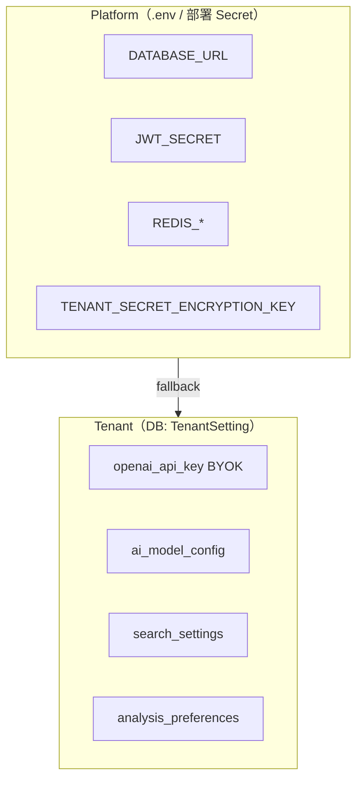
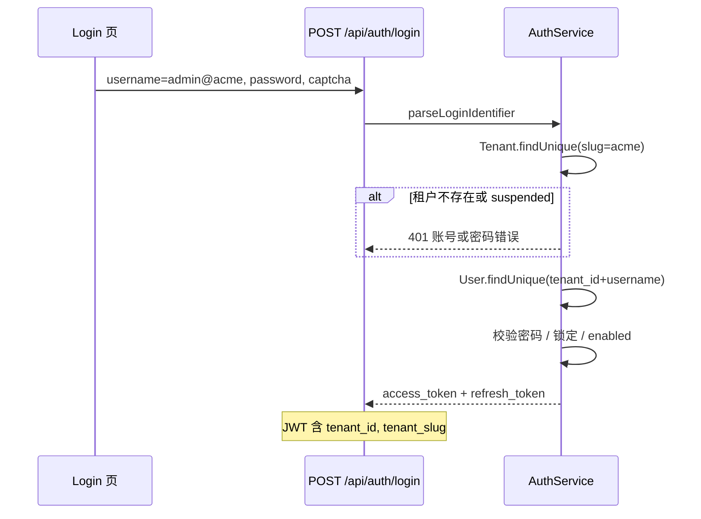

# 租户配置与 SaaS 多租户设计

## 概述

be-water 当前为**单实例部署**：业务配置分散在 `.env`（进程环境变量）与 `AppSetting` 表（运行时 JSON）两处。随着产品向 **SaaS 多租户**演进，部分集成凭据（如 OpenAI API Key）需要由**租户自行提供（BYOK）**，且必须在 Web UI（Settings）中可配置、保存即生效，**不应**通过修改 `.env` 或重启进程实现。

**设计原则**：

- **三层配置**：Platform（平台）→ Tenant（租户）→ 可选子级
- **DB 存租户配置**：敏感字段加密；非敏感字段 JSON 明文
- **运行时解析**：优先级 DB > 旧 AppSetting（迁移窗口）> Platform env > 代码默认值
- **单租户零破坏**：引入默认租户 `default`，现有用户仍可用原用户名登录（省略 `@default`）
- **登录标识**：`username@tenant_slug`；默认租户 `default` 在登录时可省略后缀
- **租户无感知**：租户侧 UI 不暴露「租户」概念；多租户能力对使用者透明
- **平台系统管理员**：独立于租户 SUPERUSER，凭 env 登录，管理租户；租户不可见该平台控制台
- **不写 `.env`**：Settings 页只操作 API → DB，不涉及文件系统或进程重启（**平台管理员账号密码除外**）

**不在本文范围**：计费、租户自助注册/onboarding UI、子域名路由实现细节。**登录**见 §5。

---

## 1. 背景与动机

### 1.1 现状

| 存储         | 示例                                           | 修改方式       | 生效   |
| ------------ | ---------------------------------------------- | -------------- | ------ |
| `.env`       | `DATABASE_URL`、`JWT_SECRET`、`OPENAI_API_KEY` | SSH / 部署脚本 | 需重启 |
| `AppSetting` | `ai_model_config`、`search_settings`           | Settings API   | 即时   |

环境变量在 `apps/server/src/lib/config.ts` 启动时通过 `dotenv` 一次性加载，运行中不可变。

调用 LLM 的业务模块若直接读取 `config.openai.apiKey`，则全实例共用同一 Key，无法按租户隔离。

### 1.2 目标场景

1. **单租户（当前）**：管理员在 Settings 填写 OpenAI API Key，不必改 `.env`、不必重启
2. **多租户 SaaS（未来）**：每个租户自带 OpenAI API Key、搜索偏好等；租户 A 的配置对租户 B 不可见
3. **平台运维**：数据库、Redis、JWT 等平台级配置仍由部署环境管理，不进 Web UI

### 1.3 明确不做

- ❌ Settings 页读写 `.env` 文件
- ❌ 通过 Web API 触发 PM2/进程重启
- ❌ 在 JWT 或 API 中回传 secret 明文（仅 `configured` + 脱敏）

---

## 2. 配置分层



### 2.1 Platform 层

**存储**：`.env`、PM2 ecosystem、CI/CD Secret。

**管理者**：运维 / 部署流水线。

**特征**：进程级；变更需重启；全平台共享。

| 变量                            | 说明                            |
| ------------------------------- | ------------------------------- |
| `DATABASE_URL`                  | PostgreSQL 连接                 |
| `JWT_SECRET`                    | 认证密钥                        |
| `REDIS_*`                       | 队列与缓存（BullMQ + ioredis）  |
| `TENANT_SECRET_ENCRYPTION_KEY`  | 租户 secret 字段 AES-GCM 主密钥 |
| `OPENAI_API_KEY`                | 平台默认 AI 密钥（fallback）    |
| `NODE_ENV`、`PORT`、`LOG_LEVEL` | 运行时                          |

### 2.2 Tenant 层

**存储**：`TenantSetting` 表（见 §4）。

**管理者**：租户管理员（`settings.read` / `settings.write`）。

**特征**：运行时读写；保存即生效；按 `tenant_id` 隔离。

| 配置 key               | 类型   | 敏感度 | 租户可编辑 | 说明                                         |
| ---------------------- | ------ | ------ | ---------- | -------------------------------------------- |
| `openai_api_key`       | string | secret | ✅         | LLM API Key（BYOK），按租户隔离              |
| `openai_api_base_url`  | string | public | ❌         | 默认使用内置 endpoint                        |
| `openai_model_name`    | string | public | ✅         | 模型名称（如 gpt-4o、deepseek-v4-flash）     |
| `ai_temperature`       | number | public | ✅         | AI 推理温度（0~2）                           |

> 上表为 secret 型租户配置的**形态示例**。实际 key 由使用它的业务模块自行注册，
> 底座只负责加密存储、按租户读取与审计。

---

## 3. 配置注册表（Config Registry）

在 `packages/shared` 集中定义配置项元数据，避免 magic string 散落。

```typescript
// packages/shared/src/tenant-config.ts（示意）

export type ConfigScope = "platform" | "tenant";
export type ConfigSensitivity = "public" | "secret";

export interface ConfigDefinition<T = unknown> {
  key: string;
  scope: ConfigScope;
  sensitivity: ConfigSensitivity;
  tenant_editable: boolean;
  validate: (value: unknown) => T;
}

export const TENANT_CONFIG_REGISTRY = {
  openai_api_key: {
    key: "openai_api_key",
    scope: "tenant",
    sensitivity: "secret",
    tenant_editable: true,
    validate: (v) => (typeof v === "string" ? v.trim() : ""),
  },
  similarity_threshold: {
    key: "similarity_threshold",
    scope: "tenant",
    sensitivity: "public",
    tenant_editable: true,
    validate: (v) => Math.max(0, Math.min(1, Number(v))),
  },
} as const satisfies Record<string, ConfigDefinition>;
```

新增可配置项时：**先改 Registry，再实现 resolver 与 UI**，保证 schema 与权限一致。

---

## 4. 数据模型

### 4.1 租户表（Phase 1）

```prisma
model Tenant {
  id         String   @id @default(uuid())
  slug       String   @unique   // 标识，如 default、acme
  name       String
  remark     String?            // 平台备注，仅 PLATFORM_ADMIN 可见/编辑
  status     TenantStatus @default(ACTIVE)  // ACTIVE | SUSPENDED
  plan       String   @default("free")      // free | pro | enterprise
  created_at DateTime @default(now())
  updated_at DateTime @updatedAt

  settings   TenantSetting[]
  users      User[]
  // 业务模块的租户级 model 在各自的 .prisma 中追加反向 relation
}

enum TenantStatus {
  ACTIVE
  SUSPENDED
}
```

**单租户迁移**：创建 `slug = "default"` 的租户，现有 `User` 与各业务 model 挂 `tenant_id = default.id`。

### 4.2 租户配置表

```prisma
model TenantSetting {
  tenant_id  String
  key        String
  value      Json              // 非敏感：明文 JSON
  secret     String?           // 敏感：AES-GCM 密文（此时 value 为空或占位）
  updated_at DateTime @updatedAt

  tenant     Tenant @relation(fields: [tenant_id], references: [id], onDelete: Cascade)

  @@id([tenant_id, key])
}
```

**敏感字段规则**：

- `sensitivity === "secret"` 的单值（如 `openai_api_key`）存 `secret` 列
- 加密使用 Platform env `TENANT_SECRET_ENCRYPTION_KEY`（32 字节）；算法 AES-256-GCM。密钥轮换需提供 `re-encrypt-tenant-secrets` 运维脚本

### 4.3 与现有 AppSetting 的关系

| 现有 key              | 目标                           |
| --------------------- | ------------------------------ |
| `ai_model_config`     | 迁入 `TenantSetting`，key 不变 |
| `search_settings`     | 迁入 `TenantSetting`，key 不变 |
| 新增 `openai_api_key` | 仅 `TenantSetting`             |

**迁移窗口**：resolver 对 `default` 租户保留读旧 `AppSetting` 的 fallback，写入只走 `TenantSetting`。

### 4.4 User 表（Phase 1）

多租户下用户名在**租户内**唯一，不再全局唯一：

```prisma
model User {
  id                    String           @id @default(uuid())
  tenant_id             String
  username              String           // 租户内登录名，不含 @tenant 后缀
  password              String
  role                  Role             @default(USER)
  enabled               Boolean          @default(true)
  last_login_at         DateTime?
  failed_login_attempts Int              @default(0)
  locked_until          DateTime?
  created_at            DateTime         @default(now())
  updated_at            DateTime         @updatedAt

  tenant                Tenant           @relation(fields: [tenant_id], references: [id])
  permissions           UserPermission[]
  refresh_tokens        RefreshToken[]
  audit_logs            AuditLog[]

  @@unique([tenant_id, username])
  @@index([tenant_id])
}
```

**迁移**：

1. 创建 `Tenant { slug: "default", name: "默认租户" }`
2. 现有 `User` 全部设置 `tenant_id = default.id`
3. 删除原 `username @unique`，改为 `@@unique([tenant_id, username])`

> 该迁移已在 init migration 中落地，此处保留为设计说明。

存储的 `username` 仅为本地部分（如 `admin`），**不含** `@default` 后缀。

---

## 5. 登录与租户识别

SaaS 多租户下，同一登录名可存在于不同租户。采用 **`username@tenant_slug`** 作为登录标识；默认租户 `default` 在登录时可省略后缀，保证现有单租户用户无感迁移。

### 5.1 标识格式

| 概念       | 字段            | 说明                                                                   |
| ---------- | --------------- | ---------------------------------------------------------------------- |
| 登录标识   | 用户输入        | 如 `admin`、`admin@default`、`bob@acme`                                |
| 本地用户名 | `User.username` | `@` 左侧，如 `admin`                                                   |
| 租户 slug  | `Tenant.slug`   | `@` 右侧，如 `default`、`acme`；常量 `DEFAULT_TENANT_SLUG = "default"` |

**tenant_slug 命名规则**：小写 `[a-z0-9][a-z0-9_-]{0,62}`，创建租户时校验。

### 5.2 解析规则

```typescript
// packages/shared/src/login-identifier.ts

export const DEFAULT_TENANT_SLUG = "default";

export function parseLoginIdentifier(input: string): {
  username: string;
  tenant_slug: string;
} {
  const trimmed = input.trim();
  if (!trimmed) {
    return { username: "", tenant_slug: DEFAULT_TENANT_SLUG };
  }

  const atIndex = trimmed.lastIndexOf("@");
  if (atIndex === -1) {
    return { username: trimmed, tenant_slug: DEFAULT_TENANT_SLUG };
  }

  const username = trimmed.slice(0, atIndex);
  const tenant_slug = trimmed.slice(atIndex + 1).toLowerCase();

  if (!username || !tenant_slug) {
    throw new InvalidLoginIdentifierError("账号格式无效");
  }

  return { username, tenant_slug };
}
```

**示例**：

| 用户输入           | 解析 username | 解析 tenant_slug | 说明                 |
| ------------------ | ------------- | ---------------- | -------------------- |
| `admin`            | `admin`       | `default`        | 单租户常用，省略租户 |
| `admin@default`    | `admin`       | `default`        | 显式指定默认租户     |
| `bob@acme`         | `bob`         | `acme`           | 多租户               |
| `admin@` / `@acme` | —             | —                | 格式错误，返回 400   |

使用 **`lastIndexOf("@")`** 分隔。

### 5.3 登录流程



**查用户**（替代当前全局 `where: { username }`）：

```typescript
const { username, tenant_slug } = parseLoginIdentifier(input.username);

const tenant = await prisma.tenant.findUnique({ where: { slug: tenant_slug } });
if (!tenant || tenant.status !== "ACTIVE") {
  throw unauthorized(); // 统一文案，不泄露租户是否存在
}

const user = await prisma.user.findUnique({
  where: {
    tenant_id_username: { tenant_id: tenant.id, username },
  },
});
```

**安全**：租户不存在、用户不存在、密码错误均返回相同文案（「账号或密码错误」），避免枚举租户 slug。

### 5.4 JWT 与请求上下文

登录成功后 JWT payload 扩展：

```typescript
interface JwtPayload {
  userId: string;
  role: "USER" | "SUPERUSER";
  tenant_id: string;
  tenant_slug: string; // 如 default、acme
}
```

Fastify 中间件从 JWT 注入：

```typescript
request.tenantContext = {
  tenant_id: payload.tenant_id,
  tenant_slug: payload.tenant_slug,
};
request.authUser = { userId, username, role, tenant_id };
```

后续 API **以 JWT 中的 `tenant_id` 为准**，不信任客户端额外传的租户 ID。所有租户级业务查询均带 `tenant_id` 过滤。

### 5.5 前端登录页

仍使用**单个账号输入框**，不单独增加「租户」字段：

- **Label**：账号
- **Placeholder（单租户 / default）**：`用户名`
- **Placeholder（多租户 SaaS）**：`用户名@组织标识`
- **提交**：原样 POST 至 `/api/auth/login`，解析在后端完成

### 5.6 注册与用户管理

| 场景                           | 行为                                                                                          |
| ------------------------------ | --------------------------------------------------------------------------------------------- |
| **Phase 0 / 单租户**           | 注册逻辑不变；用户隐式归属 `default` 租户                                                     |
| **Phase 1 注册**               | 仅允许在已存在租户内注册，或由管理员创建用户；`username` 存本地部分，租户由上下文或管理员指定 |
| **用户列表（租户 SUPERUSER）** | 仅展示本租户用户；**不**展示 `tenant_slug` / 「租户」列                                       |
| **用户列表（平台管理员）**     | 可跨租户查看，展示 `tenant_slug`                                                              |
| **创建用户**                   | 租户 SUPERUSER：只能在所属租户内创建；API 从 JWT 继承 `tenant_id`                             |

### 5.8 租户无感知（产品默认）

**结论：是。** 默认情况下，租户内的 USER / SUPERUSER **不应感知**自己处于多租户 SaaS 中。

| 层面           | 租户侧（USER / SUPERUSER）                                                  | 平台侧（PLATFORM_ADMIN）                     |
| -------------- | --------------------------------------------------------------------------- | -------------------------------------------- |
| 文案           | 不出现「租户」「Tenant」                                                    | 可称「租户 / 组织」                          |
| `/api/auth/me` | 不返回 `tenant_id`、`tenant_slug`                                           | 返回 `role: PLATFORM_ADMIN`                  |
| 导航 / 路由    | 仅现有业务菜单（文档、产品、分析、设置等）                                  | 独立 `/platform/*`，**不出现在** `navConfig` |
| Settings       | 「系统设置 / AI 配置」                                                      | 租户 CRUD、suspend、用量                     |
| 登录           | `admin` 即可（default）；多租户用户用 `bob@acme` 但登录后 UI 无「acme」标识 | `platform` 或 env 配置账号                   |

---

## 6. 运行时解析

### 6.1 解析顺序

```typescript
async function resolveTenantConfig<T>(
  tenantId: string,
  def: ConfigDefinition<T>,
): Promise<T> {
  // 1. TenantSetting（DB）
  const row = await getTenantSetting(tenantId, def.key);
  if (row) return def.validate(decryptIfNeeded(row, def));

  // 2. 旧 AppSetting（仅 default 租户，迁移窗口）
  if (tenantId === DEFAULT_TENANT_ID) {
    const legacy = await getLegacyAppSetting(def.key);
    if (legacy) return def.validate(legacy);
  }

  // 3. 代码默认值
  return def.validate(undefined);
}
```

### 6.2 租户上下文

**Phase 0（单租户）**：`tenant_id` 固定为 `DEFAULT_TENANT_ID`。

**Phase 1（多租户）**：

- 登录按 §5 解析 `username@tenant_slug`
- JWT payload 含 `tenant_id`、`tenant_slug`
- Fastify 中间件注入 `request.tenantContext`
- 所有 `TenantSetting` 读写强制 `WHERE tenant_id = request.tenantContext.tenant_id`
- 业务数据查询同样带 `tenant_id` 过滤

**从业务实体反查租户**（防客户端伪造）：

```
Note.tenant_id  → 直接字段
User.tenant_id  → 直接字段
<业务 model>.tenant_id → 直接字段（租户级 model 一律带此列）
```

---

## 7. 平台管理（Phase 2+）

### 7.1 平台管理员认证

平台管理员通过环境变量定义的凭据登录，**不经过普通 User 表**：

```env
PLATFORM_ADMIN_USERNAME=platform_admin
PLATFORM_ADMIN_PASSWORD=<generated-on-bootstrap>
```

平台管理员 JWT 中 `role = "PLATFORM_ADMIN"`，与租户 SUPERUSER **互斥**。

### 7.2 平台控制台路由

| 方法 | 路径                                   | 说明         |
| ---- | -------------------------------------- | ------------ |
| GET  | `/api/platform/tenants`                | 租户列表     |
| GET  | `/api/platform/tenants/:id`            | 租户详情     |
| PUT  | `/api/platform/tenants/:id`            | 更新租户     |
| POST | `/api/platform/tenants/:id/suspend`    | 暂停租户     |
| POST | `/api/platform/tenants/:id/reactivate` | 重新激活     |
| GET  | `/api/platform/tenants/:id/stats`      | 租户用量统计 |

### 7.3 租户暂停（Suspension）

暂停租户后：

- 所有 API 返回 `403 TENANT_SUSPENDED`
- 已有数据保留不删除
- BullMQ 任务队列停止处理该租户任务
- 前端展示「账户已暂停，请联系平台管理员」

---

## 8. 实施清单

### Phase 0 — 单租户基础（当前）

- [x] Prisma Schema 定义 Tenant、TenantSetting 模型
- [x] 创建 seed 脚本生成 `default` 租户
- [x] 所有业务模型添加 `tenant_id` 外键
- [ ] 实现 `resolveTenantConfig` 解析器
- [ ] Settings 页面支持 AI 配置编辑（OpenAI Key BYOK）

### Phase 1 — 多租户核心

- [ ] 登录接口支持 `username@tenant_slug` 解析
- [ ] JWT 扩展 `tenant_id`、`tenant_slug`
- [ ] 所有 API 路由注入 `request.tenantContext`
- [ ] 业务查询强制 `WHERE tenant_id = ?`
- [ ] 平台管理员认证与控制台基础功能

### Phase 2 — SaaS 完善

- [ ] 自助注册
- [ ] 功能开关与配额（见 `tenant-features.md`）
- [ ] 用量展示与套餐升级
